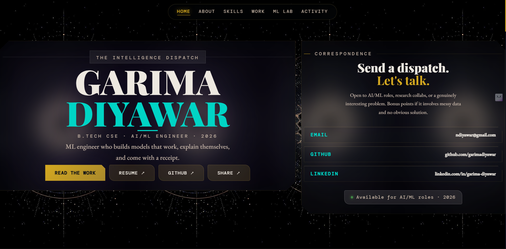

# Garima Diyawar — Portfolio

**Live:** [garimadiyawar.vercel.app](https://garimadiyawar.vercel.app/)

A polished, typographically-driven portfolio showcasing ML research and production systems. Built with React, featuring live GitHub activity, project case studies, and an interactive confusion matrix explorer from my credit risk thesis.



## Highlights

- **8 shipped projects** — from multi-agent RAG systems to audio ML pipelines
- **Live GitHub stats** — real-time repo count and contribution graph
- **ML Lab** — confusion matrix explorer with explainability context (SHAP, LIME, fairness audits)
- **Dark theme** with animated storm background and custom fonts (Playfair Display, EB Garamond, DM Mono)

## Stack

- React + TypeScript
- Custom CSS with animations and glassmorphism
- GitHub API for live metrics
- Vercel deployment

## Run locally

```bash
npm install
npm start
```

## Deploy

```bash
vercel --prod
```
